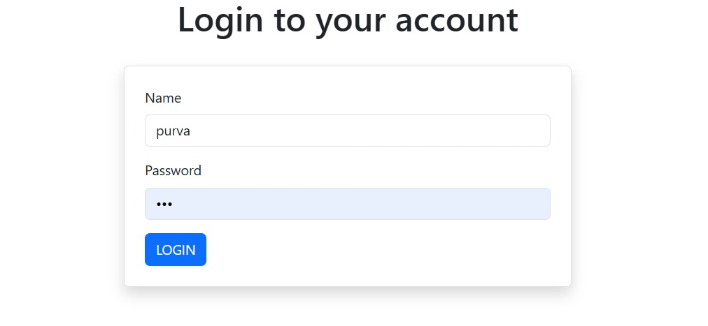
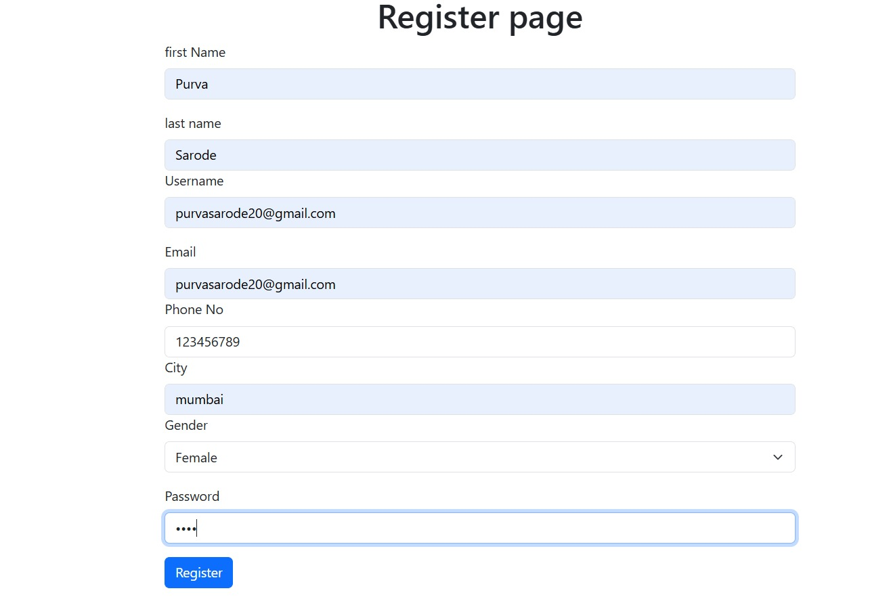
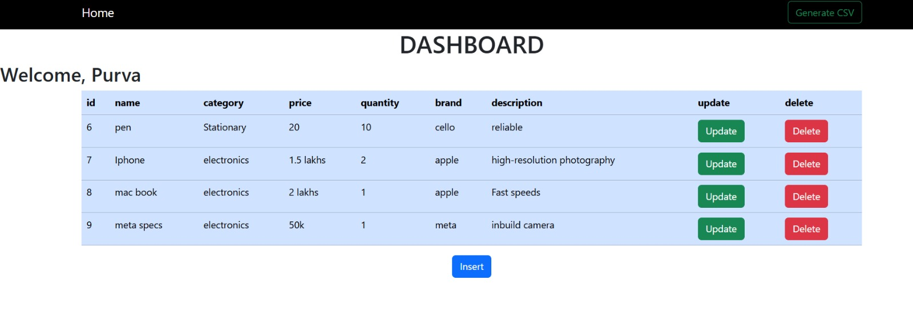
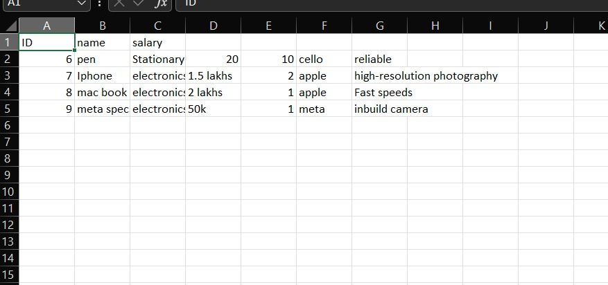

# 🛍️ Product Management System

A simple **Product Management System** built using **PHP and MySQL**.  
This project allows users to log in and manage products using CRUD operations.

---

## ✨ Features

- 🔐 User Login & Authentication
- 📝 Add Products
- 📋 View Products
- ✏️ Update Products
- 🗑️ Delete Products
- 📊 Export Products to CSV
- 🔒 Session-based Authentication
- 🎨 Responsive UI using Bootstrap

---

## 🛠️ Technologies Used

| Technology | Purpose |
|------------|---------|
| PHP | Backend |
| MySQL | Database |
| MySQLi | Database Connectivity |
| HTML | Structure |
| CSS | Styling |
| Bootstrap 5 | UI Design |
| XAMPP | Local Development Server |

---

### 🔐 Login Page

### 📝 Register Page

### 📊 Dashboard

### 📄 CSV Export

